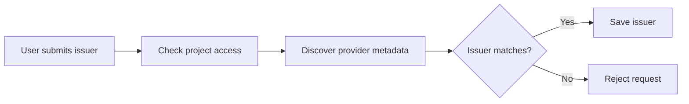

# Authoring PRs

Write for the reviewer. Explain the user goal, show this PR's contribution, and report verified results. Keep the PR short.

## Write the PR

Inspect the incremental diff, related issues, and earlier PRs before writing. Do not invent product goals, dependencies, or test results. Ask if the goal is unclear.

Use this structure. Replace the prompts with facts. Remove optional sections that do not help the reviewer.

```markdown
## Narrative
- Goal: What must the user be able to do?
- Before this PR: What do earlier PRs enable? Link them. Omit for a standalone change.
- This PR: How does this change advance the goal?
- Next: What remains in the stack? Omit if nothing remains.

## Summary
- List the important changes. Do not repeat the narrative.

## Validation
- State each check run and its result.
- State relevant tests not run and known gaps.

## Release order
- Include only when deployment order matters. Link prerequisites and state the deployment gate.
```

- Use a short title that names the change. Follow repository title conventions.
- Prefer lists to paragraphs. Aim for 150–250 words, not a minimum.
- Do not add a second motivation section, a file inventory, or repeated stack history.
- Use ASD-STE100 Simplified Technical English (STE). Use short sentences, active voice, and one topic per sentence.
- Keep instructions to 20 words per sentence and descriptions to 25. Prefer simple verb forms. Avoid idioms and ambiguous pronouns.
- Use one term for one meaning. Use approved STE vocabulary where available. Preserve exact code identifiers and necessary technical names.
- These reminders are not the full standard. Do not claim verified STE compliance without checking the applicable standard and dictionary.
- Add a small Mermaid diagram for dataflows, workflows, or complex paths when it helps explain the change. Omit it for trivial changes. Show real components and important failure paths.

Example flow, only if supported by the diff:



## Check before every push

1. Inspect the branch, base, diff, and worktree. Preserve unrelated work. Confirm authorization to publish.
2. Read `AGENTS.md` and `AGENTS.local.md` if present. Use the designated GitHub App for GitHub operations and pushes. Stop if App authentication is unavailable. Do not copy local credential setup into the PR. Preserve owner commit attribution.
3. Inspect package scripts and repository instructions. Run existing formatting, lint, type, and relevant test checks on the final changes. Do not invent scripts or add a formatter for this task.
4. In Recovery, use `mise exec -- ...` and pnpm. Run the smallest applicable check first. Run `mise run format` after code edits, `mise run lint` for fast feedback, and `mise run check` before delivery. Run `mise run doctor` for Expo dependency or config changes. Do not format generated code or vendored skills.
5. After edits or rebases, rerun affected checks. Old results and future CI runs do not satisfy this gate. If checks fail or cannot run, stop before pushing and report the blocker.
6. Publish only the checked commits. Confirm the PR body, base, and incremental diff on GitHub.

## Use `gh stack`

Run GitHub commands through the authentication wrapper required by local instructions. The commands below show the `gh` portion only.

- Inspect `gh stack --help` and relevant subcommand help. If unavailable, report the missing capability; do not silently install an extension or substitute a manual stack.
- Inspect existing state with `gh stack view`. Adopt or create branches bottom to top with `gh stack init <first> <second>`. Use `--base <trunk>` when needed. Do not initialize an existing stack again.
- Use `gh stack add <branch>` to add a layer. Use `gh stack switch`, `up`, or `down` to navigate.
- Confirm each PR targets its immediate predecessor; the bottom PR targets the trunk. Inspect each incremental diff.
- After a parent change, use `gh stack rebase`. Inspect conflicts and all affected layers, then run local checks on each changed branch before publishing.
- Use `gh stack submit` to push and create/update PRs. It can push the whole stack: check every branch it will publish. Use `gh stack push` for branch updates when PR creation is not needed.
- In non-interactive use, `gh stack submit --auto` creates draft PRs with generated titles. Replace generated titles and bodies with reviewed text using `gh pr edit --title ... --body-file ...`. Confirm the result before marking ready.
- Do not use `gh stack sync` for this workflow: it rebases and pushes without a check boundary. Use rebase → checks → submit/push instead.
- A stack is not a deployment guarantee. Verify predecessor deployment when the release order requires it.
- Do not run `gh stack merge`, enable auto-merge, or deploy without separate authorization. Never bypass review, branch protection, required checks, or merge queues.

## Shepherd after submission

Submission is not completion. Monitor every PR in the submitted scope.

1. Read all CI checks for the current head, not only required checks. Use `gh pr checks` and bounded check watches. Inspect failed job logs.
2. Read review summaries, issue comments, and inline review threads. `gh pr view --comments` alone is not enough. Use paginated API reads for review threads and their resolution state.
3. Investigate each finding. Fix valid findings within the approved scope. For a false positive, reply with concrete evidence. Do not make an unsafe change just to satisfy a bot.
4. Run local checks, commit, and push any fix. Reply with the fix and verification evidence. Resolve a thread only after its finding is addressed or an evidence-backed disposition is accepted under repository rules. An outdated thread is not automatically resolved.
5. Refresh CI and review state after each push. Wait for reviews on the latest head; an empty comment list before Cubic finishes is not completion.
6. Normally, continue until all CI passes and all review comments are resolved. **For Recovery, you may stop when all CI passes and all Cubic comments are resolved.** Include Cubic findings outside inline threads. Report any remaining human or other bot feedback; do not call the PR approved or merge-ready.
7. Pending, failed, cancelled, or missing expected checks are not green. Explain skipped or neutral checks; do not silently count them as passes.
8. Use bounded waits. Give progress updates and avoid rapid polling. If checks, reviews, permissions, or a disputed finding block progress, report the PR link, current head, blocker, and next action. Do not claim completion or promise unattended monitoring.

Do not resolve comments merely to reach zero. Do not create follow-up issues or expand scope without approval. General shepherding authorization does not authorize merges, deployments, or safeguard bypasses.
